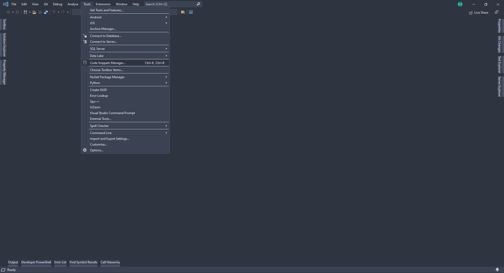
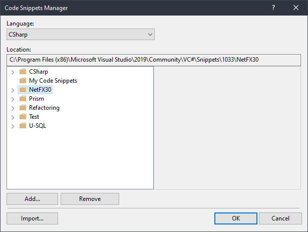

# Snippets for Visual Studio

Feel free to use the snippets for your own Visual Studio

## Installation

Clone the Repo to a specific folder

Open Code Snippet Manager:  

Use Import Button to import snippet folder for specific language. To avoid collisions with default VS snippets remove default snippet folder  

